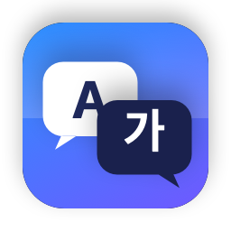

<p align="center"></p>

# QuickTranslate

[English](README.md) · 한국어

DeepL 데스크톱 클라이언트처럼 **⌘C 를 두 번** 누르면 선택한 텍스트의 번역 창이 바로 뜨는 macOS 메뉴바 앱입니다.
별도 API 키 없이 로컬에 설치된 **Claude Code CLI(Claude 구독)** 또는 **Codex CLI(ChatGPT 구독)** 를 그대로 사용합니다.

## 개인정보

번역할 텍스트는 선택한 CLI를 통해 본인 계정으로 Anthropic(Claude) 또는 OpenAI(Codex)에 전송됩니다.
그 외에는 아무것도 나가지 않습니다. 통계 수집, 크래시 리포트, API 키 모두 없습니다. 사용량은 일반 CLI 사용과 똑같이 구독에 포함됩니다.

## 요구 사항

- macOS 13 이상, Swift 5.9+ 툴체인 (Xcode Command Line Tools면 충분)
- 아래 중 하나 이상이 설치·로그인되어 있어야 합니다.
  - `claude` — [Claude Code](https://docs.claude.com/en/docs/claude-code) (`claude` 를 한 번 실행해 로그인)
  - `codex` — [Codex CLI](https://github.com/openai/codex) (`codex login`)

## 빌드 / 설치

```bash
./build.sh            # build/QuickTranslate.app 생성
./build.sh --install  # /Applications 에 복사 후 실행
```

첫 실행 시 **손쉬운 사용(Accessibility)** 권한을 요청합니다. 전역 키 입력(⌘C ⌘C)을 감지하려면 반드시 허용해야 합니다.
시스템 설정 → 개인정보 보호 및 보안 → 손쉬운 사용 → QuickTranslate 켜기.

> ad-hoc 서명(기본값)은 빌드할 때마다 서명이 바뀌어 기존 손쉬운 사용 권한이 조용히 무효화됩니다
> (목록에는 켜져 있는데 동작하지 않는 상태). `./build.sh --install` 은 설치 시 `tccutil reset` 으로
> 이 항목을 지워 다시 허용 창이 뜨게 합니다. 수동으로는 `tccutil reset Accessibility dev.swen.QuickTranslate`.
> 권한을 유지하려면 고정된 서명 ID가 필요합니다. `./make-cert.sh` 로 자체 서명 인증서("QuickTranslate Dev")를
> 로그인 키체인에 만들어 두면 `build.sh` 가 자동으로 그걸로 서명하며, 이후 재빌드해도 권한이 유지됩니다.
> Apple 개발자 인증서가 있으면 `CODESIGN_IDENTITY="Apple Development: ..." ./build.sh` 도 됩니다.
>
> 권한을 허용하면 앱을 재시작하지 않아도 2초 안에 자동으로 단축키 감지가 시작됩니다.

## 사용법

| 동작 | 방법 |
|---|---|
| 번역 창 열기 | 텍스트 선택 후 **⌘C ⌘C** (0.4초 안에 두 번) |
| 번역 언어 바꾸기 | 창 상단 언어 선택 (바꾸면 즉시 재번역) |
| 원문 수정 후 재번역 | 상단 원문 영역 편집 → **⌘⏎** |
| 번역 결과 복사 | **⇧⌘C** 또는 복사 버튼 |
| 창 닫기 | **Esc**, ⌘W, 또는 창 바깥 클릭 (번역 중에는 바깥 클릭으로 닫히지 않음) |
| 번역 중 취소 | **⌘.** 또는 취소 버튼 (이미 받은 부분은 남음) |
| 창 고정 | 📌 버튼 (바깥을 클릭해도 닫히지 않음) |

기본 동작: 텍스트를 **한국어**로 번역하고, 이미 한국어인 텍스트는 **영어**로 번역합니다. 메뉴바 아이콘 → 설정에서 바꿀 수 있습니다.

## 설정

메뉴바 아이콘 → **설정…**

- **엔진**: Claude (Claude Code CLI) / ChatGPT (Codex CLI)
- **모델**: Claude는 `haiku`(기본, 가장 빠름) / `sonnet` / `opus`, Codex는 비우면 기본 모델
- **CLI 경로**: 자동 탐색이 실패하면 직접 지정 (`~/.local/bin/claude` 등)
- **언어**: 기본 번역 언어와, 원문이 이미 그 언어일 때 사용할 언어
- **표시 언어**: 시스템 설정 따름 / English / 한국어 / 日本語 (바꾸면 앱이 다시 시작됨)
- **⌘C 두 번 인식 간격**, **바깥 클릭 시 닫기**

## 단축키가 안 잡힐 때

- **보안 키보드 입력(Secure Keyboard Entry)**: iTerm2, Ghostty, cmux 같은 터미널이나 암호 입력창이 이 기능을 켜면
  macOS가 모든 앱의 전역 키 감시를 막습니다. 그 앱이 앞에 있는 동안은 ⌘C ⌘C가 동작하지 않습니다.
  메뉴바 메뉴와 설정 창에 어느 앱이 켰는지 경고가 표시되니, 해당 앱 설정에서 끄거나 다른 앱에서 사용하세요.
- **권한을 앱 실행 후에 허용한 경우**: macOS는 실행 시점의 권한으로 키 이벤트 전달 여부를 정하므로 앱이 자동으로 한 번 재시작합니다.

## 외부에서 번역창 열기

Raycast, Hammerspoon, 다른 단축키 앱에서 아래 알림을 보내면 클립보드 번역창이 열립니다.

```bash
osascript -l JavaScript -e 'ObjC.import("Foundation"); $.NSDistributedNotificationCenter.defaultCenter.postNotificationNameObject("dev.swen.QuickTranslate.translate", $())'
```

문제가 생기면 `~/Library/Logs/QuickTranslate.log` 를 확인하세요.

## 언어

앱 UI는 영어가 기본이며, 시스템 언어가 한국어·일본어면 자동으로 그 언어로 표시됩니다.
첫 실행 시 번역 기본 언어도 시스템 언어(그리고 두 번째 선호 언어)를 따릅니다. 다른 언어를 추가하려면
`Resources/<lang>.lproj/Localizable.strings` 를 만들면 됩니다.

## 동작 방식

- `NSEvent` 전역 키 모니터로 ⌘C 두 번을 감지하고, 클립보드 문자열을 읽어 플로팅 패널(`NSPanel`)을 마우스 근처에 띄웁니다.
- Claude: `claude -p --output-format stream-json --include-partial-messages --tools "" --strict-mcp-config --setting-sources ""`
  로 실행해 토큰 단위 스트리밍으로 결과를 표시합니다. 사용자 설정·훅·MCP 서버를 로드하지 않아 빠르게 뜨고,
  확장 사고(thinking)를 꺼서(`MAX_THINKING_TOKENS=0`) `haiku` 기준 번역 한 건이 약 1.5초에 끝납니다.
- Codex: `codex exec -s read-only -o <file>` 로 실행하고 마지막 메시지를 읽습니다 (스트리밍 없음).

## 프로젝트 구조

```
Sources/QuickTranslate/
  main.swift                 앱 진입점 (메뉴바 전용, Dock 아이콘 없음)
  AppDelegate.swift          상태 표시줄 메뉴, 권한 처리, 클립보드 번역 트리거
  DoubleCopyMonitor.swift    ⌘C ⌘C 감지
  TranslationPanel.swift     플로팅 패널 (위치, 바깥 클릭 닫기, Esc)
  TranslationView.swift      패널 UI (SwiftUI)
  TranslationViewModel.swift 번역 상태 / 스트리밍 반영
  TranslationEngine.swift    claude / codex CLI 호출 및 출력 파싱
  ProcessJob.swift           자식 프로세스 실행 + stdout 라인 스트리밍
  CLILocator.swift           CLI 바이너리 탐색 (Finder에서 실행 시 PATH 보정)
  Settings.swift             UserDefaults 기반 설정
  SettingsView.swift         설정 창
```

## 기여

[CONTRIBUTING.md](CONTRIBUTING.md) (영어)를 참고하세요.

## 라이선스

[MIT](LICENSE)
